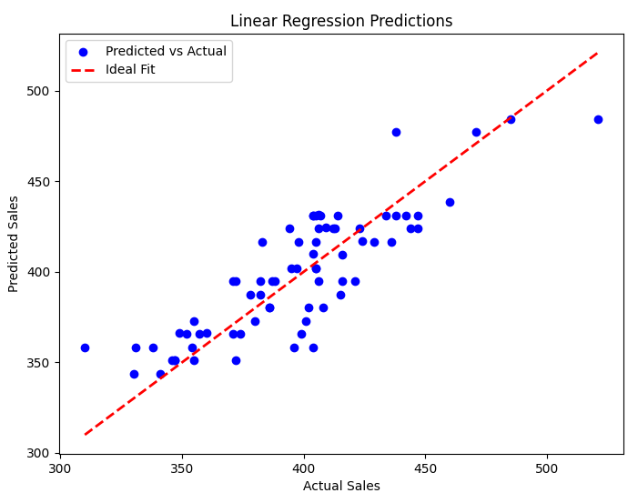
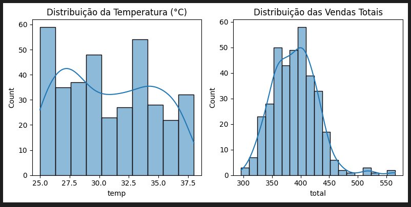
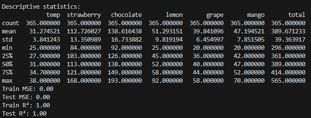
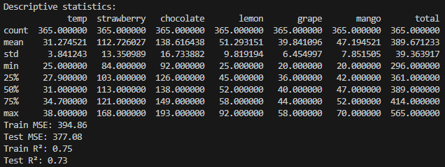
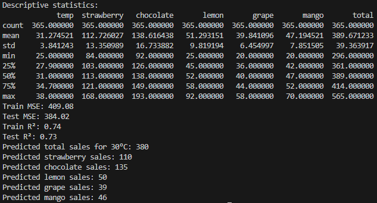

# DIO-DP100
Projetos do Bootcamp DIO | Microsoft DP-100

## Cenário

A Gelato Mágico, reconhecida por sua produção artesanal de sorvetes, tem observado uma significativa correlação entre a temperatura ambiente e o volume de vendas diárias. A ausência de um mecanismo preciso de previsão tem resultado em:

* **Gestão de Estoque Ineficiênte:** Oscilações na demanda geram excesso de estoque em períodos de baixa procura e escassez em picos de vendas, impactando negativamente os custos operacionais e a satisfação do cliente.
* **Produção Não Otimizada:** A incapacidade de antecipar a demanda dificulta o planejamento da produção, resultando em desperdício de recursos e potenciais perdas de receita.

**Solicitação:**

Desenvolvimento e a implementação de um modelo de Machine Learning que permita a previsão precisa das vendas diárias de sorvete, com base na análise de dados históricos de vendas, temperatura e outras variáveis relevantes.

**Objetivos:**

A implementação do modelo preditivo visa alcançar os seguintes objetivos:

* Redução significativa do desperdício de produtos.
* Otimização da produção e gestão de estoque.
* Maximização da lucratividade da Gelato Mágico.

**Requisitos:**

* Análise e tratamento de dados históricos para identificação de padrões e correlações.
* Desenvolvimento de um modelo preditivo preciso e confiável.
* Validação e testes do modelo para garantir sua precisão e robustez.

# Aprendizado

Este projeto teve como objetivo desenvolver um modelo de Machine Learning para prever as vendas de sorvete da Gelato Mágico, com base em diversos fatores como temperatura, feriados e eventos especiais.

Durante o desenvolvimento deste projeto, tive a oportunidade de aprimorar minhas habilidades em diversas áreas do Machine Learning, desde a análise exploratória dos dados até o treinamento e avaliação de modelos.

### Análise Preliminar e Exploratória dos Dados

Inicialmente, realizei uma análise preliminar dos dados para obter um entendimento geral do conjunto de dados e suas características. Essa etapa foi fundamental para identificar as variáveis relevantes e planejar as próximas etapas do projeto. A análise exploratória (EDA) revelou uma forte correlação entre a temperatura e as vendas de sorvete, confirmando a intuição de que dias mais quentes tendem a ter mais vendas.

### Treinamento Inicial e Overfitting

Na primeira tentativa de treinamento do modelo, utilizei apenas a temperatura como variável preditora. No entanto, o modelo resultante apresentou um desempenho insatisfatório, com indícios de overfitting. Isso significa que o modelo se ajustou muito bem aos dados de treinamento, mas não conseguiu generalizar bem para os dados de teste.

### Melhoria do Modelo com Novas Variáveis

Para melhorar o desempenho do modelo, decidi incorporar outras variáveis relevantes, como a ocorrência de feriados e eventos especiais. Essa abordagem se mostrou eficaz, resultando em um modelo mais robusto e preciso, capaz de capturar melhor a complexidade do problema.

### Aplicação em Cenário Real

Embora os dados utilizados neste projeto sejam simulados, o cenário representa um ótimo exemplo de como o Machine Learning pode ser aplicado em situações reais para otimizar processos e auxiliar na tomada de decisões. A capacidade de prever a demanda de sorvete com base em diversos fatores pode ser extremamente valiosa para a Gelato Mágico, permitindo um planejamento mais eficiente da produção e do estoque.

### Conclusão

Este projeto me proporcionou um aprendizado valioso sobre o processo de desenvolvimento de modelos de Machine Learning, desde a análise dos dados até a otimização do modelo. A experiência adquirida neste projeto será fundamental para futuros desafios e projetos na área de Ciência de Dados.

## Informações dos Arquivos

* **gelato_magico.ipynb** -> Notebook com todo o processo de análise e desenvolvimento do modelo comentado.
* **gera_dados.py** -> script para geração dos dados que foram utilizados neste projeto.
* **linear_regressor.py** -> código para treinamento do modelo sem análises e com exemplo de uso no final
* **vendas_sorveteria.csv** -> dataset gerado pelo script **gera_dados.py**.
